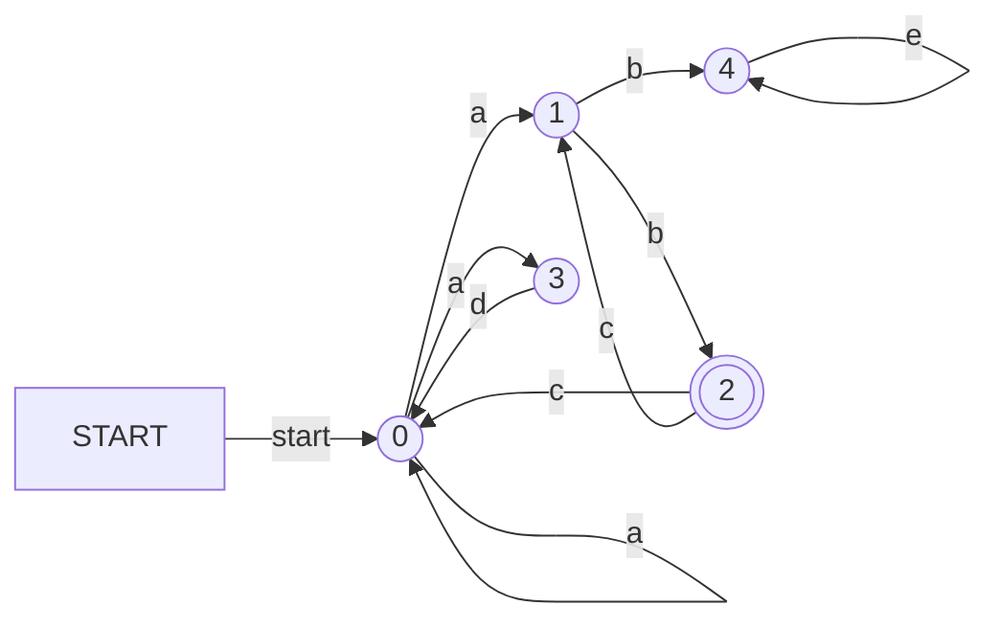

# Compiler 

Compiler in Go 

## Standards
### Errors
Errors should at a MINIMUM specify the method they came from and give an error message that starts lowercase (unless the first thing needs to be capitalized). It should have the following structure:

`[source method] err msg`

If you would like to chain multiple errors together separate each one by a \n and use %w to print the error. For example:

`fmt.Errorf("[main] failed to convert rule because:\n%w", err)`

### Production Rules
#### Grammar
```
P -> Rule("\n"Rule)*
Rule -> WS* NT WS* "->" WS*Prod("|"Prod)*WS*
Prod -> Token*
Token -> WS*(NonTerm | Term | Range)WS*
NonTerm -> [^ \n\t\"[]]*
Term -> "\"" AllChars* "\""

Range -> "[" ("{"RangeChars"-"RangeChars"})? "^"? InnerRange "]"
InnerRange -> (RangeChars("-"RangeChars | RangeChars*))?
RangeChars -> [^\^\-\{\}\\] | "\\^" | "\\-" | "\\{" | "\\}" | "\\\\"

AllChars -> [^]

```
Note: V is all characters and WS is all white space characters.

#### Ranges
Note: In order to use `^`, `-`, `{`, or `}` in a range, please escape it.

In order to easily use a range of characters in a production, you can use square brackets with a range inside like so:

`[a-z]`

This however gets clunky if you have only a lot of disjoint characters that you would like to group. For that, you can simply put a string within `[]` which will match as long as any of the characters in the string matched (similar to many alternations). Here is an example that would match "hello world":

`[helowrd]`

You can also specify to take the opposite of a range or group of characters by adding a `^` to the front. For example:

`[^A-Z] or [^helowrd]`

By default, taking the opposite will use the range $0-2^{31}$ as the language but this is often not desirable (for example with ascii encoding) and can be changed by using `{}` at the front with another range within. For example the following will match any lower case character other than g:

`[{a-z}^g]`

Note: While specifying a range for the language is possible for non inverting (not using `^`) ranges, it will not do anything and should be avoided.

Grammar for Ranges:
```
P -> "["E"]"
E -> "{"ToRange"}"InvertibleRange | InvertibleRange
InvertibleRange -> Range | "^"Range
Range -> CharRange | ToRange
CharRange -> v*
ToRange -> v"-"v
v -> all characters
```


Option 1: In Go
```
type tokenName = string
type tokenRegex = string

type TType int

type TokenInfo struct { //called TokenInitInfo 
    Id TType
    Name TokenName
    Regex TokenRegex 
    fa State 
}

type Scanner struct {   
    tokens []TokenInfo //order in terms of priority 
}

type Expr struct {}
type Constant struct {}
type Node struct {
}

type FAConverter interface {
    convert func()*State, *State //start, end 
}

func (s *Scanner) convertTokenRegexToDFA {
     for k,v := range tokens {
       //function that calls recursive descent parser 
       parseTree := getParseTree(v)
       fa := parseTree.getFA().removeLambdas().convertToPseudoDFA().minimize()
       tokenFA[k] = fa 
     }
}

type Token struct {
    id TType
    lexeme string 
    line uint 
}

func (s *Scanner) Scan(file) []Token { 
    //go through the file
    //start at first character, go through list of fas in priority order until it finds a match or hits dead state in all of them
        if dead state in all of them, then theres a source code error
        if a match, create a Token w/ all the fields, and append to token return array. 
    repeat until it reaches the EOF character. }

func main() {
    //user must also initialize TokenType w/ Enum -> how?  
    s := Scanner{
        tokens: map[tokenName]tokenRegex { 
            "for": "for", 
            "identifier": "[a-z]([a-z]|[0-9])*"
        }
    } //initialize scanner
    s.convertTokenRegexToDFA() //do this in a NewScanner Function, that the user doesnt have to call it 

    s.Scan(file) //take in source code file 
}
```

Option 2: In File 

//TODO: make sure all files have a consistent naming structure


-------------
Regex Grammar specification "frontend"

Regex Grammar w/ literals in ""
P -> E
E -> TE'
E' -> "|" TE' | epsilon
T -> FT'
T' -> FT' | epsilon
F -> GF'
F' -> "*"F' | epsilon
G -> "("E")" | "v" //where v is any byte

//TODO: can include this example in the documentation?
```
type Rule struct {
    terminal string 
    nonTerminal string 
}

type Grammar struct {
    Rules: []*Rule
}

//raw string 
g := &Grammar { 
    Rules: []*Rule {
        //P -> E 
        {
            terminal: `P`, 
            nonTerminal: `"|"TE'` 
        },
        //E -> TE'
        {
            terminal: `E`, 
            nonTerminal: 
        }, 
    }
}

```

