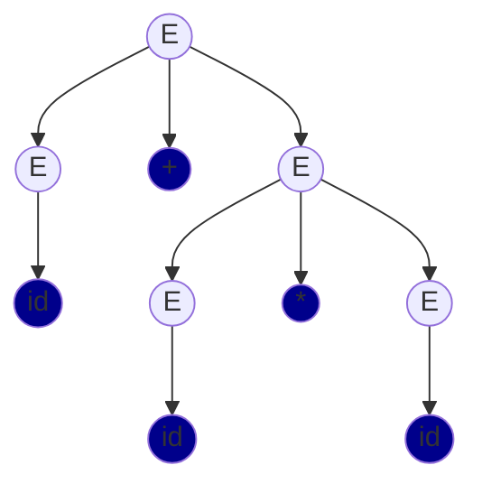

#### Introduction

This Go module will take in a text file containing regex rules and return an instance of a `Scanner` class.

#### Parsing Regex

The goal is to convert a regular expression $E$ into a parse tree.

We will use the following definition of a regular expression:

> A **regular expression** $s$ is a string which denotes $L(s)$, where $L(s)$ is the set of strings drawn from alphabet $\Sigma$.
>	$L(s)$ is defined inductively with the following base cases:
>		1) if $a \in \Sigma$, then $a$ is a regular expression and $L(a) = \{  a \}$.
>		2) if $\epsilon$ is a regular expression, then $L(\epsilon)$ contains only the empty string
>
Then for any regular expressions $s$ and $t$:
1) $s|t$ is an RE such that $L(s|t) = L(s) \cup L(t)$
2) $st$ is an RE such that $L(st)$ contains all the strings formed by concatenating a string in $L(s)$ followed by a string in $L(t)$
3) $s*$ is a RE such that $L(s*) = L(s)$ concatenated zero or more times

Using the above definition, here are a few examples of valid regular expressions: $ab|c$, $a(b|a)*a$, $(aaa)*$, etc.

We can start with the following grammar $G$:
- $E \rightarrow E \ | \ E$
- $E \rightarrow EE$ (*Note: represented as $E + E$ in the parse tree)
- $E \rightarrow E *$
- $E \rightarrow (E)$
- $E \rightarrow v$, where $v$ is any byte


The set of terminals $T$ is in $G$ is $T = \{ |, *, (, ), v\}$.

Note that $G$ is currently ambiguous, meaning it could lead to multiple valid parse tree derivations from the same input, and hence unpredictable, inconsistent behavior from the parser.
##### Removing Ambiguity in $G$

**Modifying $G$ to prevent Associativity Property Violation**:

We know the following:
> Alternation is left associative (ex. $a | b | c$ should be interpreted as $(a|b)|c$)
> Concatenation is left associative (ex. $abc$ should be interpreted as $(ab)c$)
> Kleene Closure is unary

Currently, $G$ violates the associativity property.

Take the following example regex: $s=abc$. Two possible parse trees can be produced from $G$ as of now, leading to ambiguity:

```
Possible Parse Tree 1: +(+(a, b), c)

	E 
  E +  E 
E + E  v
v   v  c
a   b 
```

```
Possible Parse Tree 2: +(a, +(b, c))

	E
 E  +   E 
 v    E + E
 a	  v   v
      b   c
```

We know from above only *Possible Parse Tree 1* is valid.

To satisfy left associativity, we can use left recursive rules; hence the grammar will expand the non-terminal $E$ from the leftmost occurrence, creating a parse tree that grows leftward, and forcing for operations to be evaluated from left to right.

Let's rewrite $G$ as the following:
- $E \rightarrow E \ | \ v$
- $E \rightarrow Ev$
- $E \rightarrow E *$
- $E \rightarrow (E)$
- $E \rightarrow v$, where $v$ is any byte


**Modifying $G$ to Prevent Precedence Property Violation**:

Continuing the definition of a regular expression, we know:

> Kleene closure ($s*$) the highest precedence.
> Concatenation ($st$) has next highest precedence.
> Alternation ($s|t$) has the lowest precedence.

Currently, $G$ violates the precedence property as per regex precedence rules.

Take the following example regex: $s = ab|c$, where $L(s) = \{ab, c \}$. Two possible parse trees can be produced from $G$ as of now, leading to ambiguity:

```
Possible Parse Tree 1: +(a, |(b,c))
	  E 
	E + E
	v   E | E
	a	v   v
		b   c
```


```
Possible Parse Tree 2: +(+(a, b), c)

	    E 
	E   | E
  E + E	  v
  v + v   c
  a   b
```


We know from the definition of a regex above that only *Possible Parse Tree 2* is valid.

As the generated parse tree is traversed in a "top to bottom," "left to right" manner, operators of higher precedence must be in the lower levels of the parse tree. #TODO: **mention top down parsing (leftmost derivation)**.

Let's rewrite $G$ as the following:

- $E \rightarrow [E\ | \ T] \ | \ T$ (*Note: $[, ]$ are NOT non terminals. They are simply used for grouping.)
- $T \rightarrow T F \ | \ F$
- $F \rightarrow G* | \ G$
- $G \rightarrow (E) \ | \ v$, where $v$ is any byte

Now the parse tree for $s$ would be:

```
Unambiguous Valid Parse Tree: +(+(a, b), c)

				  E 
				  T
			  T   +  F
		    T + F    G
			F   G    v
			G   v    c
			v   b 
			a
```

#TODO: check ambiguity
##### Eliminating Left Recursion in $G$

We must convert all our left recursive production rules ($A \rightarrow A\alpha | \beta$) to right recursive rules ($A \rightarrow \alpha A | \beta$), to avoid the possibility of an infinite loop during top down evaluation. #TODO: explain why left recursion is bad better

To eliminate left recursion, we can convert a left recursive production rule in the format $A \rightarrow A \alpha \ | \ \beta$ to $A \rightarrow \beta A'$ and $A' \rightarrow \alpha A ' \ | \ \epsilon$.

Let's rewrite $G$ as the following:

- $E \rightarrow TE'$
- $E' \rightarrow \ [\ | TE' \ ] \ | \ \epsilon$ (*Note: $[, ]$ are NOT terminals. They are simply used for grouping.)
- $T \rightarrow F T'$
- $T' \rightarrow FT' \ | \ \epsilon$
- $F \rightarrow G* | \ G$
- $G \rightarrow (E) \ | \ v$, where $v$ is any byte

##### Creating a Recursive Descent Parser for Regex

The parser will generate a parse tree for a given regex, if the regex is generated from $G$. The only decision the parser will make is what production to use.

Each non-terminal in the grammar will have a different function. 


#### Introduction
1
This Go module will take in a text file containing regex rules and return an instance of a `Scanner` class.

#### Parsing Regex

##### Test Cases


##### Introduction

The goal is to convert a regular expression $E$ into a parse tree.

We will use the following definition of a regular expression:

> A **regular expression** $s$ is a string which denotes $L(s)$, where $L(s)$ is the set of strings drawn from alphabet $\Sigma$.
>	$L(s)$ is defined inductively with the following base cases:
>		1) if $a \in \Sigma$, then $a$ is a regular expression and $L(a) = \{  a \}$.
>		2) if $\epsilon$ is a regular expression, then $L(\epsilon)$ contains only the empty string
>
Then for any regular expressions $s$ and $t$:
1) $s|t$ is an RE such that $L(s|t) = L(s) \cup L(t)$
2) $st$ is an RE such that $L(st)$ contains all the strings formed by concatenating a string in $L(s)$ followed by a string in $L(t)$
3) $s*$ is a RE such that $L(s*) = L(s)$ concatenated zero or more times

Using the above definition, here are a few examples of valid regular expressions: $ab|c$, $a(b|a)*a$, $(aaa)*$, etc.

We can start with the following grammar $G$:
- $E \rightarrow E \ | \ E$
- $E \rightarrow EE$ (*Note: represented as $E + E$ in the parse tree)
- $E \rightarrow E *$
- $E \rightarrow (E)$
- $E \rightarrow v$, where $v$ is any byte

The set of terminals $T$ is in $G$ is $T = \{ |, *, (, ), v\}$.

Note that $G$ is currently ambiguous, meaning it could lead to multiple valid parse tree derivations from the same input, and hence unpredictable, inconsistent behavior from the parser.
##### Removing Ambiguity in $G$

**Modifying $G$ to prevent Associativity Property Violation**:

We know the following:
> Alternation is left associative (ex. $a | b | c$ should be interpreted as $(a|b)|c$)
> Concatenation is left associative (ex. $abc$ should be interpreted as $(ab)c$)
> Kleene Closure is unary

Currently, $G$ violates the associativity property.

Take the following example regex: $s=abc$. Two possible parse trees can be produced from $G$ as of now, leading to ambiguity:

```
Possible Parse Tree 1: +(+(a, b), c)

	E 
  E +  E 
E + E  v
v   v  c
a   b 
```

```
Possible Parse Tree 2: +(a, +(b, c))

	E
 E  +   E 
 v    E + E
 a	  v   v
      b   c

```

We know from above only *Possible Parse Tree 1* is valid.

To satisfy left associativity, we can use left recursive rules; hence the grammar will expand the non-terminal $E$ from the leftmost occurrence, creating a parse tree that grows leftward, and forcing for operations to be evaluated from left to right.

Let's rewrite $G$ as the following:

- $S \rightarrow E$
- $E \rightarrow E \ | \ T$
- $E \rightarrow T$
- $T \rightarrow TF$
- $T \rightarrow F$
- $F \rightarrow F*$
- $F \rightarrow (E)$
- $F \rightarrow v$, where $v$ is any byte


```

a(cat | cow)*

	S
	E
	T
    TFxx
   F F*
   v  (E)* 
   a   E|T
	   

```


**Modifying $G$ to Prevent Precedence Property Violation**:

Continuing the definition of a regular expression, we know:

> Kleene closure ($s*$) the highest precedence.
> Concatenation ($st$) has next highest precedence.
> Alternation ($s|t$) has the lowest precedence.

Currently, $G$ violates the precedence property as per regex precedence rules.

#TODO: this is wrong
Take the following example regex: $s = ab|c$, where $L(s) = \{ab, c \}$. Two possible parse trees can be produced from $G$ as of now, leading to ambiguity:

```
Possible Parse Tree 1: +(a, |(b,c))
	  E 
	E + E
	v   E | E
	a	v   v
		b   c
```


```
Possible Parse Tree 2: +(+(a, b), c)

	    E 
	E   | E
  E + E	  v
  v + v   c
  a   b
```


We know from the definition of a regex above that only *Possible Parse Tree 2* is valid.

As the generated parse tree is traversed in a "top to bottom," "left to right" manner, operators of higher precedence must be in the lower levels of the parse tree. #TODO: **mention top down parsing (leftmost derivation)**.

Let's rewrite $G$ as the following:

- $E \rightarrow E\ | \ T  \ \ or \ T$ (*Note: $[, ]$ are NOT non terminals. They are simply used for grouping.)
- $T \rightarrow T F \ or \ F$
- $F \rightarrow G* \ or \ G$
- $G \rightarrow (E) \ or \ v$, where $v$ is any byte

```

a(c|b)*


	E 
	T
    TF
    a G*
      (E)*
		(E|T)*
		(c|b)*
```


Now the parse tree for $s$ would be:

```
Unambiguous Valid Parse Tree: +(+(a, b), c)

				  E 
				  T
			  T   +  F
		    T + F    G
			F   G    v
			G   v    c
			v   b 
			a
```

#TODO: check ambiguity
##### Eliminating Left Recursion in $G$

We must convert all our left recursive production rules ($A \rightarrow A\alpha | \beta$) to right recursive rules ($A \rightarrow \alpha A | \beta$), to avoid the possibility of an infinite loop during top down evaluation. #TODO: explain why left recursion is bad better

To eliminate left recursion, we can convert a left recursive production rule in the format $A \rightarrow A \alpha \ | \ \beta$ to $A \rightarrow \beta A'$ and $A' \rightarrow \alpha A ' \ | \ \epsilon$.

Let's rewrite $G$ as the following:

- $E \rightarrow TE'$
- $E' \rightarrow \ [\ | TE' \ ] \ | \ \epsilon$ (*Note: $[, ]$ are NOT terminals. They are simply used for grouping.)
- $T \rightarrow F T'$
- $T' \rightarrow FT' \ | \ \epsilon$
- $F \rightarrow G* | \ G$
- $G \rightarrow (E) \ | \ v$, where $v$ is any byte

##### Creating a Recursive Descent Parser for Regex

The parser will generate a parse tree for a given regex, if the regex is generated from $G$. The only decision the parser will make is what production to use.

Each non-terminal in the grammar will have a different function.



